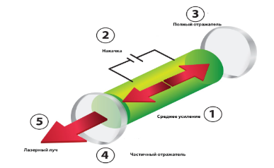
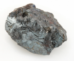
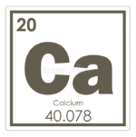
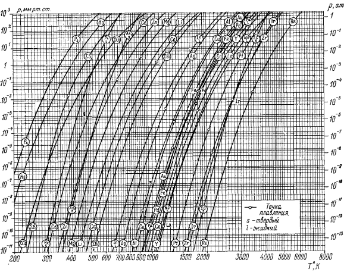
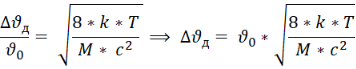
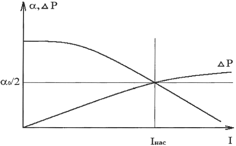

# LaserSystemsAndTechnologies

# **Оглавление**
[Принцип работы лазера.	3](#_toc185543890)

[Кальций	5](#_toc185543891)

[Подбор рабочей температуры образцовой ячейки с парами цезия.	8](#_toc185543892)

[Расчет доплеровской линии уширения и интенсивности насыщения для атома кальция	9](#_toc185543893)

[Выбор лазера	11](#_toc185543894)

[Выбор фотоприемника	12](#_toc185543895)

[Список литературы	13](#_toc185543896)

##

##

## **Принцип работы лазера.**

Лазер — это устройство, которое генерирует узконаправленный, монохроматический (одна длина волны) и когерентный (волны синхронизированы по фазе) пучок света. Название "лазер" — это аббревиатура от "Light Amplification by Stimulated Emission of Radiation" (усиление света с помощью вынужденного излучения).

Работа лазера основана на трёх основных процессах:

1\. **Спонтанное излучение:** Атом, находящийся в возбужденном энергетическом состоянии, может самопроизвольно перейти в состояние с меньшей энергией, излучив фотон (квант света). Направление и фаза излучаемого фотона случайны.

2\. **Вынужденное излучение:** Если возбуждённый атом взаимодействует с фотоном, имеющим энергию, равную разности энергий между возбужденным и основным состояниями атома, то он может перейти в основное состояние, излучив фотон с той же энергией, направлением и фазой, что и падающий фотон. Это и есть вынужденное излучение, лежащее в основе работы лазера.

3\. **Оптическое усиление:** В лазере создаётся инверсия населённости — ситуация, когда число атомов в возбужденном состоянии больше, чем в основном. Это достигается с помощью процесса накачки (подвода энергии). При прохождении фотона через среду с инверсией населённости происходит вынужденное излучение, и число фотонов лавинообразно возрастает.

**Основные компоненты лазера:**

• **Активная среда:** Материал (твёрдое тело, газ, жидкость или полупроводник), в котором создаётся инверсия населённости и происходит генерация лазерного излучения.

• **Система накачки:** Источник энергии, который возбуждает атомы активной среды до более высоких энергетических уровней. Это может быть электрический разряд, лампа накачки, другой лазер или полупроводниковый диод.

• **Оптический резонатор:** Система зеркал, расположенных по обе стороны активной среды. Зеркала отражают свет обратно в активную среду, усиливая его многократным прохождением через неё. Одно из зеркал обычно частично прозрачно, позволяя части излучения выходить из резонатора в виде лазерного луча.

**Основные свойства лазера:**

1) Высокая мощность.
1) Когерентность и монохроматичность лазерного излучения;
1) Направленность: 

   Направленность лазерного излучения определяется тем, что в открытом резонаторе возникают только такие волны, которые направлены по его оси или под ее малыми углами. Если степень пространственной когерентности высока, угол расходимости лазерного луча может быть сделан близким к пределу, определяемой дифракцией.

##
##

##

## **Кальций**

Кальций (Ca) — это химический элемент с атомным номером 20, расположенный в 4-м периоде и 2-й группе (щелочноземельные металлы) периодической таблицы Менделеева. Он является достаточно распространённым элементом в земной коре и играет важнейшую биологическую роль.

Электронная конфигурация атома кальция 1s² 2s² 2p⁶ 3s² 3p⁶ 4s². Потенциал ионизации (первый электрон) атома кальция равен 589,8 кДж/моль (6,1131 эВ).

##### **Получение**

` `Кальций получают электролизом расплава безводного хлорида кальция (CaCl₂) или путем восстановления оксида кальция алюминием или ферросилицием.   

##### **Изотопы**

Кальций имеет шесть стабильных изотопов: ⁴⁰Ca, ⁴²Ca, ⁴³Ca, ⁴⁴Ca, ⁴⁶Ca и ⁴⁸Ca. ⁴⁰Ca является наиболее распространенным (около 97%).

**Физические свойства**

Кальций (Ca), элемент с атомным номером 20, представляет собой серебристо-белый металл, достаточно мягкий, чтобы его можно было резать ножом. Его относительно низкая плотность (1,55 г/см³), низкие температуры плавления (842 °C) и кипения (1484 °C) характерны для щелочноземельных металлов. Кальций — хороший проводник электричества и тепла, кристаллизуется в гранецентрированной кубической решетке и проявляет диамагнетизм. На воздухе быстро покрывается оксидной пленкой, что делает его внешний вид тусклым и затрудняет изучение в чистом виде.

**Химические свойства**

Химически кальций весьма активен, особенно по отношению к воде и кислотам. Он легко теряет два электрона с внешней электронной оболочки, проявляя постоянную степень окисления +2. Реакция с водой приводит к образованию гидроксида кальция Ca(OH)₂ и выделению водорода. Взаимодействие с кислотами протекает бурно, с образованием солей кальция и выделением водорода. Кальций образует множество солей, многие из которых (например, карбонат, сульфат и фосфат кальция) плохо растворимы в воде. Его способность к комплексообразованию относительно слаба по сравнению с переходными металлами.
###### **Биологическая роль**

Кальций (Ca) играет чрезвычайно важную и многогранную роль в биологических системах, участвуя в широком спектре процессов на клеточном и организменном уровнях. Его функции обусловлены уникальными свойствами иона Ca²⁺:

**1. Структурная функция:**

• **Кости и зубы:** Кальций является основным структурным компонентом костной ткани и зубов в виде гидроксиапатита Ca₅(PO₄)₃OH. Он обеспечивает прочность и жесткость скелета, защищая внутренние органы и обеспечивая опору для движения. Регуляция обмена кальция в костях является сложным процессом, вовлекающим остеобласты (клетки, образующие костную ткань), остеокласты (клетки, разрушающие костную ткань) и остеоциты (зрелые клетки костной ткани).

**2. Сигнальная функция:**

• **Внутриклеточный мессенджер:** Ион Ca²⁺ выступает в качестве универсального внутриклеточного мессенджера, участвуя в передаче сигналов внутри клетки. Изменение концентрации ионов Ca²⁺ в цитоплазме служит триггером для множества клеточных процессов. Концентрация свободного Ca²⁺ в цитоплазме поддерживается на очень низком уровне, и кратковременные повышения его концентрации ("Ca²⁺-сигналы") запускают каскады внутриклеточных реакций.

• **Мышечное сокращение:** Ca²⁺ необходим для мышечного сокращения. При возбуждении мышечного волокна ионы Ca²⁺ высвобождаются из саркоплазматического ретикулума (специальный внутриклеточный резервуар Ca²⁺) и связываются с белком тропонином, инициируя взаимодействие актина и миозина и приводя к сокращению мышц. Этот процесс происходит как в скелетных, так и в гладких мышцах, а также в сердечной мышце.

• **Нервная проводимость:** Ca²⁺ играет ключевую роль в передаче нервных импульсов. Приток ионов Ca²⁺ в пресинаптическую терминаль нервного волокна вызывает высвобождение нейромедиаторов в синаптическую щель, обеспечивая передачу сигнала на следующую клетку. Это важно для процессов восприятия, мышления, памяти и др.

• **Клеточный цикл:** Регуляция концентрации Ca²⁺ необходима для прохождения разных фаз клеточного цикла
**3. Другие функции:**

• **Свертывание крови:** Ca²⁺ является кофактором многих ферментов, участвующих в процессе свертывания крови. Он необходим для активации факторов свертывания и формирования тромбина, ключевого фермента, отвечающего за образование фибрина.

• **Секреция:** Ca²⁺ регулирует секрецию гормонов, нейромедиаторов и других биологически активных веществ. Повышение концентрации Ca²⁺ в клетке стимулирует экзоцитоз — процесс выброса веществ из клетки.

• **Апоптоз (программируемая клеточная смерть):** Ca²⁺ участвует в регуляции апоптоза, контролируя баланс между жизнью и смертью клеток.

• **Иммунитет:** Кальций необходим для функционирования иммунной системы. Он участвует в активации иммунных клеток, фагоцитозе и других иммунных процессах.

• **Поддержание кислотно-щелочного баланса:** Кальций может участвовать в буферных системах организма, помогая поддерживать стабильный pH крови.

##### **Выбор перехода**

|Длина волны|Энергетические уровни, см-1|gA, 108 сeк-1|gf|lg gf|
| :- | :- | :- | :- | :- |
|2398\.56|0 - 41679|0\.35|0\.030|-1.52|
|2721\.64|0 - 36732|0\.074|0\.0082|-2.09|
|**4226.73**|**0 - 23652**|**1.0**|**0.28**|**-0.55**|
|6572\.78|0 - 15210|0\.00021|0\.00014|-3.86|
||<h3></h3>||||
*Таблица 1.*

По таблице 1 выбираем переход с нулевого уровня энергии и максимальным значением gA. 

λ= **4226.73** \* 10-10 м

gA=1\* 108 c-1= А21, так как g=1 для данной системы. 

Частота спонтанного перехода:

ʋ0  = cλ = 3 \* 1084226.73 \* 10-10= 7.0976 \* 1014 Гц

Время жизни спонтанного перехода:

τ = 1А21=11 \* 108=1\*10-8 с

## **Подбор рабочей температуры образцовой ячейки с парами кальция.**

Выбираем рабочую точку исходя из диаграммы упругости паров, представленной на рис.1

 

*Рис.1. Рабочая точка для атома Ca на диаграмме упругости паров химических элементов*

По кривой упругости паров элементов определяем температуру и давления: 

Т = 600К, 

Р = 1 \* 10-1 мм.рт.ст. = 2 \* 10-4 Па.

Из уравнения идеального газа:

P\*V=n\*k\*T

В данном уравнении k=1,38\*10-23ДжК-постоянная Больцмана,

n – количество регистрируемых частиц.

Выразим давление из уравнения идеального газа:

P=n\*k\*TV      \*.

Из уравнения (\*) видно, что N= nV. Таким образом концентрация частиц в единице объема рассчитывается по следующей формуле:

Расчет концентрации частиц для атома кальция:

n = Pk\* T = 2 \* 10-4 Па1.38\*10-23 \* 600К=2.42\*1016 1м3

## **Расчет доплеровской линии уширения и интенсивности насыщения для атома кальция**

Доплеровское уширение рассчитывается по формуле:

Где М – атомная масса.

Для того чтобы найти массу атома кальция в килограммах воспользуемся следующей формулой:

M=1 а.ед.м.\*Матома=1.66\*10-27\*40.078=6.653\*10-26 кг

Таким образом, доплеровская ширина спектральной линии атома Ca равна:

ΔυД=υD\*8\*k\*T1M\*c2= 7.0976\*1014\*8\*1.38\*10-23\*6006.653\*10-26\*3\*1082=2.361\*109 Гц

Сечение поглощения излучения:

σ=ln2π\*λ2ΔυД\*А214\*π=ln2π\*4226.73 \* 10-1022.361\*109\*1\*1084\*π=2.828\*10-16 м2 

Интенсивность насыщения находится по формуле:

Iнас=h\*υ0σ\*τ  ,  где h=6.6262\*10-34 Джс – постоянная Планка. 

Отсюда интенсивность насыщения:

Iнас=h\*υ0σ\*τ=6.6262\*10-34\*7.0976\*1014 2.828\*10-16\*1\*10-8 =1.66\*105 Втм2

##
##
##

## **Выбор лазера**

При проведении теоретического исследования мы выяснили, что оптимальной интенсивностью лазерного излучения является интенсивность, не превышающая интенсивность насыщения I ≤ Iнас.

Для решения нашей задачи целесообразнее всего использовать лазер на органических красителях. Источником накачки в таких лазерах, как правило, служит аргоновый лазер. 

Так как λ=423\*10-9 м,  то воспользуемся карбостирилом 165.

Карбостирил 165, также известный как 2-хинолинон, представляет собой гетероциклическое органическое соединение. Такое органическое соединение, используется в качестве красителя в различных лазерах. Его химическая формула C₉H₇NO.

|Органическое соединение|Растворитель|Длина волны генерации, нм|
| :-: | :-: | :-: |
|
Карбостирил 165

S3
|
DMSO

CyHx
|
419 - 485

410 - 470
|

В данном случае подходит 2 лазера с соответствующими длинами волн генераций. Рассчитаем мощность лазера:

Pлаз= Iнас\*S;

В данной формуле S – площадь лазерного пучка.

S= π\* d24

d=2\*10-3м
S= π\* d24= π\* 2\*10-324=3.14\* 10-6м2

Таким образом мощность лазера равна:

Pлаз= Iнас\*S= 2.2\*105\* 3.14\* 10-6=0.69 Вт

## **Выбор фотоприемника**

Необходимо выбрать фотоприемник с минимальным уровнем шума.

В основе работы полупроводниковых фотоприемников лежит p-n переход. Одним из таких элементов является фотодиод. 

Подберём фотоприемник с наименьшим шумом под диапазон лазера:

|Наименование|∆λ, нм|Up, В|Iобщ, мА|τ, пс|Pмакс, мВт|Pшум, Вт|
| :-: | :-: | :-: | :-: | :-: | :-: | :-: |
|PWPR-2K-SI|400 - 1000|15|10|35 -200|5|8\.6\*10-15|

Вычислим минимальное детектируемое изменение мощности:

∆Pmin=4\*P\*Pшум=4\* 5\*10-3\*8.6\*10-15=2.62\*10-8 Вт

Рассчитаем минимальное число частиц, которое можно обнаружить:

nmin= 1q0\* 4\* τ\*∆Pminh\*v= 4\* 200\*10-12\* 2.62\*10-86,6262\*10-34\*447\*1012= 70

В данной формуле 

q0-относительная доля частиц на нижнем уровне, равная единице.

Вычислим насыщающий коэффициент поглощения при N2=0, N1=nmin:

α0= ln2π\* λ2∆ϑд\*А214\*π\*N1- N2=ln2π\* 423\*10-923.123\*109\*1\* 1084\*π\*70=1.49\*10-14 м-1 

## **Список литературы**

1. «Справочник по лазерам» под редакцией А.М.Прохорова;
1. Ч.Корлисс, У.Бозман «Вероятности переходов и силы осцилляторов 70 элементов» в переводе О.Н. Митропольской;
1. Бруннер В. Справочник по лазерной технике;
1. Зайдель А.Н. и др. «Техника и практика спектроскопии»
1. Приемники и детекторы излучений. Справочник;
1. https://www.meetoptics.com/detection-devices/photodiodes-sensors-and-modules/unmounted-si-photodiode/s/thorlabs/p/FDS015?srsltid=AfmBOoop9V0jelrVsWrNIYy-V5fUCdb5puNqfk2MpiJD0g6htbiXl6Ty
11

